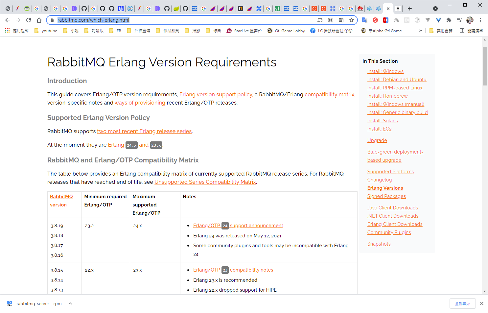

# RabbitMQ

RabbitMQ 筆記

# 消息中間件簡介及應用場景

參考之前的筆記

https://github.com/IvesShe/Java_Kafka


# RabbitMQ簡介

RabbitMQ是一個開源的、遵循AMQP協議實現基於Erlang語言編寫，支持多種客戶端(語言)。用於在分布式系統中存儲消息，轉發消息，具有高可用、高可擴性、易用性等特徵。

# RabbitMQ下載

https://www.rabbitmq.com/


下載

https://www.rabbitmq.com/download.html


RabbitMQ 與 Erlang 版本對照表

https://www.rabbitmq.com/which-erlang.html



# Erlang

Erlang官網

https://www.erlang-solutions.com/


下載

https://www.erlang-solutions.com/downloads/


 

# 安裝

將捉下來的兩個檔案上傳到gcp服務器


分別解壓縮

```bash
rpm -Uvh esl-erlang_R16B03-4_centos_6_amd64.rpm
```


執行之後發現報錯，仔細看了erlang-solutions的官網，下方有教學，改依照這邊的步驟進行

```bash
wget https://packages.erlang-solutions.com/erlang-solutions-2.0-1.noarch.rpm
```


```bash
rpm -Uvh erlang-solutions-2.0-1.noarch.rpm
```


```bash
yum install -y erlang
```


```bash
yum install -y socat
```


```bash
rpm -Uvh rabbitmq-server-3.8.19-1.el7.noarch.rpm 

```


```bash
yum install rabbitmq-server -y
```

安裝完成


# 啟動RabbitMQ

```bash
# 啟動
systemctl start rabbitmq-server 
# 檢查狀態
systemctl status rabbitmq-server
```

順利啟動


停止服務器

```bash
systemctl stop rabbitmq-server 
```

開機自動啟動

```bash
systemctl enable rabbitmq-server 
```

# RabbitMQ Web管理界面

安裝

```bash
rabbitmq-plugins enable rabbitmq_management
```


安裝完成可以在瀏覽器訪問

35.229.195.168:15672

如果不能訪問，要打開防火牆，因為我是使用GCP，所以需要設定GCP的防火牆規則

設定可參考之前的文章

https://github.com/IvesShe/GCP_Nodejs_Nginx


設定完成，可以順利看到登入畫面了


預設帳號、密碼是guest，但預設僅限本機使用


## 新增用戶

```bash
rabbitmqctl add_user admin 密碼
```


## 設置用戶分配操作權限

```bash
rabbitmqctl set_user_tags admin administrator
```


用戶級別：

- administrator 可以登錄控制台、查看所有信息，可以對rabitmq進行管理
- monitoring 監控者 登錄控制台，查看所有信息
- policymaker 策略制定者 登錄控制台，指定策略
- management 普通管理員 登錄控制台

## 為用戶資源添加權限

```bash
rabbitmqctl set_permissions -p / admin ".*" ".*" ".*"
```


如果已經是administrator，是可以不用再作權限添加

# 再次訪問

輸入新建的帳號，可以成功登入了


# rabbitmqctl指令

```bash
# 新建帳號
rabbitmqctl adduser 帳號 密碼

# 添加用戶級別
rabbitmqctl set_user_tags 帳號 用戶級別

# 修改密碼
rabbitmqctl change_password Username Newpassword 

# 刪除用戶
rabbitmqctl delete_user Username

# 查看用戶清單
rabbitmqctl list_users

# 為用戶設置administrator角色
rabbitmqctl set_permissions -p / 用戶名 ".*" ".*" ".*"
```

也可以透過web界面作新增修改

